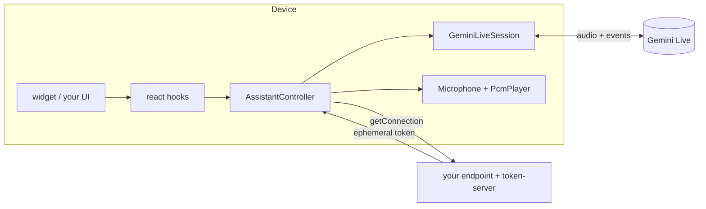

# Live Assistant

A real-time voice assistant for React Native apps (iOS, Android and the web).
You provide a token and a few tools. The library handles the microphone, the
speaker, interruptions, the transcript and the tool calls. You can drop in the
ready-made widget, or build your own UI on the headless hooks.

v1 runs on **Gemini Live**. The session is written against a provider-neutral
port, so other realtime providers can be added without changing your UI.

| Package | What it is | Where it runs |
|---|---|---|
| `@live-assistant/core` | The controller, the session port, tools, transcript, levels | anywhere |
| `@live-assistant/gemini` | The Gemini Live session (socket, handshake, frames) | client |
| `@live-assistant/audio` | Microphone and speaker for iOS, Android and the web | client (React Native) |
| `@live-assistant/react` | Headless hooks: state, transcript, per-frame levels, tools | client (React) |
| `@live-assistant/widget` | A drop-in orb and panel, themed and worded by you | client (React Native / web) |
| `@live-assistant/token-server` | Mints short-lived Gemini tokens, so your API key never ships | your server (Node ≥ 18) |



## Quick start (with the widget)

**1. On your server**, mint a token after your own auth:

```ts
import { mintGeminiLiveToken } from '@live-assistant/token-server';

app.post('/assistant/token', requireUser, async (req, res) => {
  const minted = await mintGeminiLiveToken({
    apiKey: process.env.GEMINI_API_KEY!,
    model: 'models/gemini-3.1-flash-live-preview',
    systemInstruction: 'You are the assistant inside Acme Notes. Be brief.',
    tools: toolDefinitions, // the same definitions the app registers handlers for
    voiceName: 'Aoede',
    languageCode: req.body.languageCode ?? 'en-US',
    resumptionHandle: req.body.resumptionHandle,
  });
  if (!minted.ok) return res.status(503).json({ error: minted.failure.code });
  res.json(minted.value);
});
```

**2. In the app**, build the controller once and render the widget near the root:

```tsx
import { AssistantController, ToolRegistry } from '@live-assistant/core';
import { GeminiLiveSession } from '@live-assistant/gemini';
import { Microphone, PcmPlayer } from '@live-assistant/audio';
import { AssistantProvider } from '@live-assistant/react';
import { AssistantWidget } from '@live-assistant/widget';

const tools = new ToolRegistry([
  {
    definition: {
      name: 'createNote',
      description: 'Creates a note with the given text',
      parameters: { type: 'object', properties: { text: { type: 'string' } }, required: ['text'] },
    },
    run: async ({ text }) => ({ ok: true, id: await notes.create(String(text)) }),
  },
]);

const assistant = new AssistantController({
  session: new GeminiLiveSession(),
  microphone: new Microphone(),
  player: new PcmPlayer(),
  tools,
  getConnection: async ({ resumptionHandle }) => {
    const response = await fetch('/assistant/token', {
      method: 'POST',
      body: JSON.stringify({ resumptionHandle, languageCode: 'en-US' }),
    });
    if (!response.ok) throw await response.json(); // comes back as failure.cause
    return response.json();
  },
});

export function App() {
  return (
    <AssistantProvider controller={assistant}>
      <Navigation />
      <AssistantWidget />
    </AssistantProvider>
  );
}
```

## Customising the widget

```tsx
<AssistantWidget
  placement="bottom-left"
  theme={{ colors: { primary: '#E4572E', assistantGlow: '#FFB400' }, radius: 8 }}
  strings={{ status: { listening: 'Dinliyorum' }, stop: 'Bitir', errors: { microphone_denied: 'Mikrofon kapalı' } }}
  renderMessage={(entry, fallback) => (
    <Row>
      <Avatar who={entry.speaker} />
      {fallback}
    </Row>
  )}
  renderTool={(entry) => (entry.status === 'succeeded' ? <DoneChip name={entry.call.name} /> : null)}
/>
```

- **`theme`** overrides colours, orb size, radius, spacing, font size and panel height. Anything you leave out keeps the default.
- **`strings`** overrides every word the widget shows or reads out, including statuses, errors, end reasons and tool chips. The defaults are in English.
- **`renderMessage` / `renderTool`** receive each transcript entry together with the default rendering (`fallback`), so you can wrap it, replace it, or hide it.
- `AssistantOrb`, `AssistantPanel`, `AssistantTranscript`, `StatusLine`, `MessageBubble` and `ToolChip` are also exported, so you can compose your own layout from them.

## Headless (your own UI)

Everything the widget draws with is public, and nothing in it is private to the widget:

```tsx
import { useAssistant, useLevelFrames, useTranscript } from '@live-assistant/react';

function MyAssistantBar() {
  const { status, isMuted, error, start, stop, toggleMute, sendText } = useAssistant();
  const transcript = useTranscript(); // entries: { kind: 'message', speaker, text, isFinal } | { kind: 'tool', call, status }

  const userRing = useRef(new Animated.Value(0)).current;
  const assistantGlow = useRef(new Animated.Value(0)).current;
  useLevelFrames(({ input, output }) => {
    // Called every animation frame; nothing re-renders.
    userRing.setValue(input);      // the user talking
    assistantGlow.setValue(output); // the assistant talking (what is heard)
  });
  // …
}
```

- **Levels are never React state.** `useLevelFrames` gives you both levels (0–1) on every frame, for effects that follow each voice. `useAssistantLevels()` hands you the raw sources instead, if your animation library polls on its own clock. `smoothLevel` from core gives frame-rate-independent easing.
- **The output level follows the playhead.** A reply arrives seconds before it is heard, so the level tracks what is playing now, not what has just arrived.
- **`useAssistantState(selector)`** re-renders only when the slice you selected changes.
- **`useAssistantTool(tool)`** registers a screen-specific tool while that component is mounted. The model has to know the tool already, so declare it when you mint the token.
- Without React, `AssistantController` works on its own: `start()`, `stop()`, `setMuted()`, `sendText()`, `subscribe()`/`getState()` (compatible with `useSyncExternalStore`), `inputLevel` and `outputLevel`.

## What the controller takes care of

These behaviours are built in, and each one fixes a problem seen in production:

- **Start order.** It asks for the microphone before spending a token, and subscribes before connecting.
- **Abandoned starts.** Calling `stop()` while a session is starting releases everything that was opened.
- **Interruptions.** When the user talks over the assistant, the unheard audio is dropped.
- **Echo.** Where a platform cannot cancel echo (Android's default recorder), the microphone is held shut while the assistant is audible.
- **Transcript.** Fragments are joined into messages. `thinking` is shown between the user finishing and the reply starting, and `no_answer` is raised when nothing comes back.
- **Tool calls.** They run one at a time, and every call is answered, including unknown names and handlers that throw. Calls the model withdraws never run.
- **Handovers.** When the provider hands the session over (`goAway`), it reconnects through `getConnection({ resumptionHandle })` with a limit on attempts.
- **Silence.** Sessions end after a quiet spell (90 s by default; configurable, or `null` to never end), because an open microphone is billed.

## Errors

Failures come back as codes, never as user-facing text. The widget maps them through `strings.errors`, and your own UI maps them however it likes:

`microphone_denied` · `microphone_unavailable` · `player_unavailable` · `connection_refused` (your `getConnection` threw; the thrown value is in `cause`) · `connection_lost` · `connect_timed_out` · `socket_failed` · `closed_before_ready` · `no_answer`

## Notes

- **Audio.** `@live-assistant/audio` needs `react-native-audio-api` (≥ 0.13.3) on native. On the web it uses Web Audio. On iOS the session runs in `voiceChat` mode, which gives echo cancellation. Android's recorder has none, which is why the controller's echo gate exists.
- **Model names.** Verify the model you configure. A model can appear in the model list and still not be callable.
- **Configuration lives in the token.** Gemini fixes the session setup when the token is minted, and a setup sent by the client is discarded.
